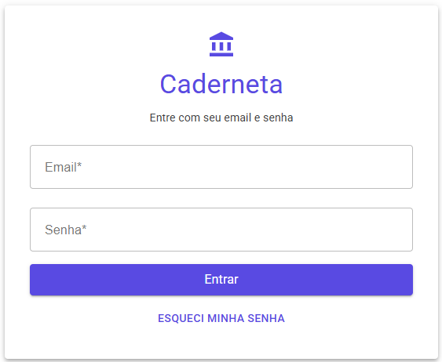
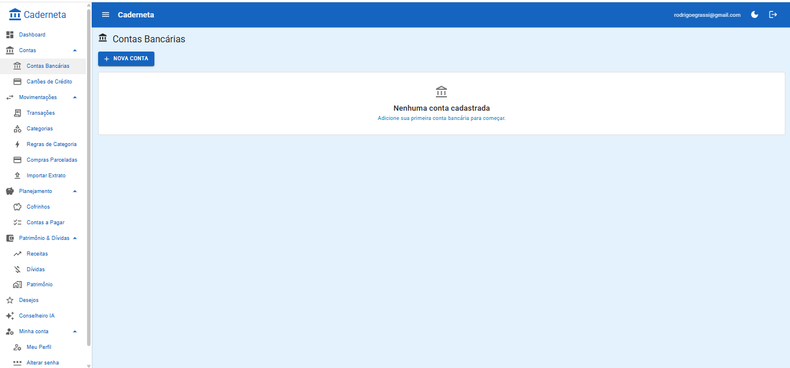

---
title: Caderneta
tagline: Controle financeiro pessoal com um conselheiro de IA
status: Em homologação — SaaS multiusuário, acesso por convite
stack: [Blazor WebAssembly, ASP.NET Core, PostgreSQL, OpenRouter, Docker Swarm]
---

# Caderneta

> Tudo anotado, como na caderneta do armazém — só que agora com alguém para conversar sobre as contas.

O nome vem das cadernetas de antigamente: a da farmácia, a do açougue, a do armazém. Cada compra ficava anotada, e no fim do mês dava pra ver exatamente para onde o dinheiro tinha ido. A Caderneta faz o mesmo, sem o lápis atrás da orelha.

## Motivação

A Caderneta nasceu de uma dor pessoal. Com contas em mais de um banco e mais de um cartão de crédito, eu controlava tudo "no achômetro". Faltava visibilidade: para onde o dinheiro ia, onde dava para cortar e como começar a investir com método.

Os apps de mercado costumam seguir dois caminhos: exigem lançar cada gasto à mão ou pedem acesso direto à conta no banco. A Caderneta segue um terceiro:

- **Tudo entra pelos extratos e faturas que o banco já fornece.** O lançamento manual fica só para compras parceladas e gastos em dinheiro.
- **O sistema consolida, categoriza e aprende** com as correções do usuário.
- **Um conselheiro com IA lê esse retrato** e ajuda a decidir o próximo passo.

Começou como ferramenta pessoal, mas foi projetada como SaaS desde o primeiro commit, com multi-tenant desde o início. Hoje está em homologação e roda como sistema multiusuário, com entrada apenas por convite.

## O que ela faz

**Contas e cartões.** Cadastro de contas bancárias e cartões de crédito, cada um com sua cor para facilitar a leitura.

**Importação.** Extratos em OFX e faturas em CSV, sempre com uma etapa de revisão antes de confirmar.

<!-- print: categorias -->

**Transações.** Todas as movimentações consolidadas num lugar só, com forma de pagamento e status de revisão.

**Categorização que aprende.** O sistema já vem com categorias padrão protegidas (Alimentação, Moradia, Saúde...), e o usuário cria as suas por cima. Ao categorizar uma transação o usuário pode transformar a escolha em regra ("contém IFOOD → Alimentação"). As próximas importações já chegam categorizadas.

**Compras parceladas.** A compra é registrada uma vez e o sistema projeta todas as parcelas. Quando a fatura é importada, ele concilia sozinho ("SAMSUNG STORE 8/12" vira "Smart TV, parcela 8/12"). Na dúvida, sugere a vinculação e deixa o usuário decidir.

**Contas a pagar.** Despesas recorrentes do mês: aluguel, luz, internet.

**Receitas, dívidas e patrimônio.** A visão completa: renda, dívidas ativas com taxas e prazos, e patrimônio declarado.

**Cofrinhos.** Metas de economia com barra de progresso e sugestão de aporte mensal.

**Lista de desejos.** Sonhos que ainda não têm data ("trocar de carro", "uma moto"), e que entram no planejamento do conselheiro.

**Conselheiro financeiro (IA).** Diagnóstico e conversa em tempo real sobre a situação financeira de verdade do usuário.

**Plano Vivo.** Um plano de ação persistente. A IA sugere ações durante a conversa, o usuário confirma e acompanha o andamento. Planos antigos são arquivados e viram histórico para as próximas conversas.

## Como a IA é usada

O conselheiro funciona como um "CFO pessoal". Ele não conversa no vazio: a cada sessão, o backend monta um contexto financeiro consolidado — saldos, receita, gastos por categoria, dívidas, patrimônio, cofrinhos, desejos, contas do mês e o Plano Vivo, ativo e arquivado — e envia junto com a pergunta.

O prompt de sistema carrega uma filosofia financeira em seis etapas, e a IA sempre diz em qual delas o usuário está:

1. Diagnóstico
2. Reserva de emergência de seis meses
3. Quitação das dívidas caras
4. Tesouro Selic
5. Objetivos de médio prazo
6. Longo prazo

A IA expõe o raciocínio antes da conclusão e deixa claro que não substitui um consultor profissional em decisões de alto impacto.

Alguns detalhes técnicos:

- **Streaming via SSE**: a resposta aparece no navegador enquanto é gerada.
- **Ações estruturadas**: quando a IA sugere uma ação, ela vem num formato estruturado que a interface mostra para o usuário confirmar antes de salvar no Plano Vivo. Quem decide é sempre a pessoa.
- **Independência de provedor**: começou com a API da Anthropic (Claude Sonnet) e migrou para o OpenRouter. O modelo virou configuração, não código — dá para testar Claude, GPT, Gemini ou DeepSeek sem mexer em nada.
- **Prompt caching**: com modelos da Anthropic, o bloco de sistema vai em cache, o que barateia as mensagens seguintes.
- **Rate limiting** no conselheiro, porque cada chamada tem custo real.

<!-- print: conselheiro IA -->

## Privacidade e LGPD

Dado financeiro é dado sensível, e isso guiou várias decisões do projeto.

**Pseudoanonimização antes de chegar à IA.** Seguindo o princípio da minimização da LGPD (art. 6º, III), os identificadores que não ajudam no conselho são trocados por rótulos neutros antes de o contexto sair do servidor: o nome vira "o usuário", as contas viram "Conta A" e "Conta B", as dívidas viram "Dívida 1" e "Dívida 2", os bens viram "Ativo 1" e "Ativo 2". Valores, taxas, prazos e categorias continuam intactos, porque são eles que dão qualidade ao conselho. A troca acontece só na camada de infraestrutura: o banco não é alterado e o modelo recebe um contexto coerente, sem ruído de mascaramento.

**Consentimento explícito.** Antes de usar o conselheiro, o usuário é informado de que os dados serão compartilhados com um provedor de IA, e o consentimento fica registrado.

**Isolamento entre usuários em duas camadas.** Filtro por tenant na aplicação e Row-Level Security no PostgreSQL. Se um filtro for esquecido no código, o próprio banco impede que dados de um usuário apareçam para outro.

**Segredos fora do código** e **rate limiting** contra força bruta no login, enumeração de contas e abuso de custo da IA.

## Tecnologias

| Camada | Tecnologia |
|---|---|
| Frontend | Blazor WebAssembly (PWA) + MudBlazor |
| Backend | ASP.NET Core Minimal API |
| Banco de dados | PostgreSQL 17 com EF Core |
| IA | OpenRouter (Claude, GPT e outros), streaming SSE, prompt caching |
| Padrões | Clean Architecture, DDD, CQRS com MediatR |
| Validação | Flunt no domínio, FluentValidation nos commands |
| Importação | CsvHelper e parser OFX próprio |
| Testes | xUnit, FluentAssertions, Testcontainers (PostgreSQL real), WebApplicationFactory |
| Infra | Docker Swarm em VPS, Traefik com TLS, imagens com tag imutável para rollback |

## Arquitetura e processo

- **Clean Architecture em camadas**: Core (domínio), Aplicação (casos de uso via CQRS), Infra, Api, Web e Compartilhado (contratos entre API e frontend).
- **Bounded contexts**: Contas, Transações, Cofrinhos, Dívidas, Patrimônio, Receita, Desejos, Identidade e Conselheiro.
- **Código em português brasileiro**, decisão registrada em ADR.
- **Identificadores públicos em UUID v7.**
- **Spec-Driven Development com OpenSpec**: cada funcionalidade nasce como proposta, passa por um design com alternativas descartadas e riscos, e só então vira tarefas. São mais de 30 mudanças documentadas, além dos ADRs.
- Cerca de **18 mil linhas de C#**, com quatro projetos de teste (Core, Aplicação, Infra e API).

## Como é usar

1. Cadastrar contas e cartões.
2. Importar o extrato (OFX) ou a fatura (CSV).
3. Revisar: as regras aplicam categorias, as parcelas são conciliadas e o usuário confirma.
4. Ver o retrato consolidado: gastos por categoria, contas a pagar, dívidas, patrimônio, cofrinhos.
5. Conversar com o conselheiro, que diz em que etapa a pessoa está.
6. Confirmar as ações sugeridas, que entram no Plano Vivo.
7. Acompanhar e concluir as ações — e o conselheiro leva esse histórico em conta na próxima conversa.

